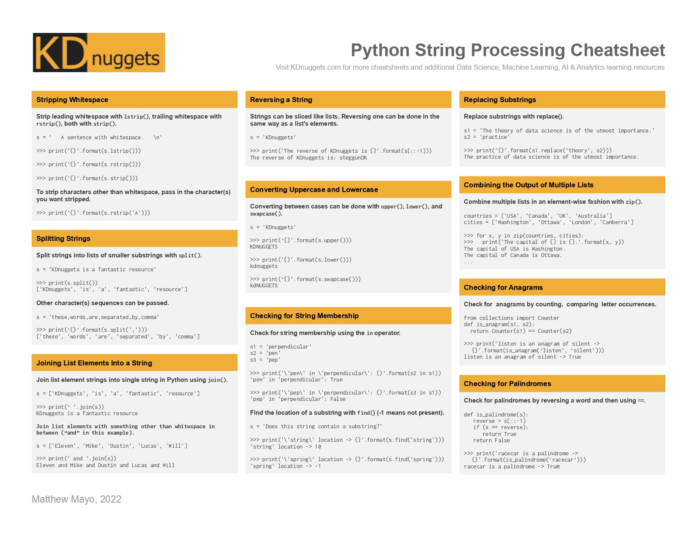

<h1 align="center">🌱 30 Days of Python 🌱</h1>
<p align="center">
  <a href="./Day05.md" target=""></a>  <a href="./Day07.md" target=""></a>
</p>


## **Day 6: Strings ,String Manipulation, fstring, and doc string**

### **Objective**
By the end of Day 6, you will understand strings, know how to manipulate them, and be familiar with important string functions in Python. We’ll cover string operations, slicing, and formatting, with hands-on examples.

#### Video Links

1. [Vid 1](https://www.youtube.com/watch?v=ORCuz7s5cCY&list=PLu0W_9lII9agwh1XjRt242xIpHhPT2llg&index=11)
2. [Vid 2](https://www.youtube.com/watch?v=Pu5bqySSSS0&list=PLu0W_9lII9agwh1XjRt242xIpHhPT2llg&index=12)
3. [Vid 3](https://www.youtube.com/watch?v=WvG-R-xXouA&list=PLu0W_9lII9agwh1XjRt242xIpHhPT2llg&index=13)
4. [vid 4](https://www.youtube.com/watch?v=ixmxgUf8yIg&list=PLu0W_9lII9agwh1XjRt242xIpHhPT2llg&index=28&ab_channel=CodeWithHarry)
5. [vid 5](https://www.youtube.com/watch?v=ixmxgUf8yIg&list=PLu0W_9lII9agwh1XjRt242xIpHhPT2llg&index=29&ab_channel=CodeWithHarry)
---

### **1. Theory**

#### **1.1 Introduction to Strings**

- **What is a String?**
  - A string is a sequence of characters enclosed within single (`'...'`), double (`"..."`), or triple quotes (`'''...'''` or `"""..."""`). Strings are commonly used for representing text data.
  - **Examples**:
    ```python
    name = "Swati"
    quote = 'The journey of learning is never-ending.'
    description = """This is a multi-line
    string in Python."""
    ```

- **String Immutability**:
  - Strings in Python are immutable, meaning once a string is created, it cannot be modified. However, you can create a new string based on modifications of the original one.

#### **1.2 Basic String Operations**

- **Concatenation**: Combine strings using the `+` operator.
  ```python
  first_name = "Swati"
  last_name = "Sahu"
  full_name = first_name + " " + last_name
  print(full_name)  # Output: Swati Sahu
  ```

- **Repetition**: Repeat strings using the `*` operator.
  ```python
  laugh = "Ha" * 3
  print(laugh)  # Output: HaHaHa
  ```

- **Length of a String**: Use `len()` to find the length of a string.
  ```python
  text = "Hello, Swati!"
  print(len(text))  # Output: 13
  ```

#### **1.3 Indexing and Slicing Strings**

- **Indexing**:
  - Each character in a string has a position called an index. Python uses zero-based indexing, so the first character is at index `0`.
  - **Example**:
    ```python
    greeting = "Hello, Swati!"
    print(greeting[0])  # Output: H
    print(greeting[7])  # Output: S
    ```

- **Negative Indexing**:
  - You can use negative indices to access characters from the end of the string.
  - **Example**:
    ```python
    print(greeting[-1])  # Output: !
    print(greeting[-6])  # Output: S
    ```

- **Slicing**:
  - Use slicing to extract a substring from a string. The syntax is `string[start:end]`, where `start` is inclusive, and `end` is exclusive.
  - **Example**:
    ```python
    phrase = "Python Programming"
    print(phrase[0:6])    # Output: Python
    print(phrase[7:])     # Output: Programming
    print(phrase[:6])     # Output: Python
    ```

#### **1.4 Important String Methods**

1. **`.upper()`** and **`.lower()`**: Convert to uppercase or lowercase.
   ```python
   text = "Learning Python"
   print(text.upper())    # Output: LEARNING PYTHON
   print(text.lower())    # Output: learning python
   ```

2. **`.strip()`**: Remove leading and trailing whitespace.
   ```python
   messy_text = "   Hello, Swati!   "
   print(messy_text.strip())  # Output: Hello, Swati!
   ```

3. **`.replace(old, new)`**: Replace parts of a string.
   ```python
   text = "I love painting."
   updated_text = text.replace("painting", "coding")
   print(updated_text)  # Output: I love coding.
   ```

4. **`.find(substring)`**: Find the position of a substring.
   ```python
   quote = "To be or not to be."
   print(quote.find("be"))   # Output: 3 (first occurrence)
   ```

5. **`.split(delimiter)`**: Split a string into a list based on a delimiter.
   ```python
   sentence = "Python is fun to learn"
   words = sentence.split(" ")
   print(words)  # Output: ['Python', 'is', 'fun', 'to', 'learn']
   ```

6. **`.join(iterable)`**: Join elements of an iterable (like a list) into a single string.
   ```python
   words = ['Learning', 'Python', 'is', 'fun']
   sentence = " ".join(words)
   print(sentence)  # Output: Learning Python is fun
   ```

#### **1.5 String Formatting**

1. **Using f-Strings**:
   - F-strings make it easy to format strings by embedding variables directly in the text.
   ```python
   name = "Swati"
   age = 25
   intro = f"My name is {name} and I am {age} years old."
   print(intro)
   ```

2. **Using `.format()`**:
   ```python
   language = "Python"
   sentence = "I love programming in {}.".format(language)
   print(sentence)  # Output: I love programming in Python.
   ```

---

### **2. Practical Examples**

Let’s look at some practical applications of strings that Swati might enjoy working with.

#### **2.1 Personal Introduction**

```python
name = "Swati"
hobby = "painting"
city = "Bhopal"

intro = f"Hello, I'm {name}, and I enjoy {hobby} in my free time. I'm from {city}."
print(intro)
```

#### **2.2 Creating a Simple Poem**

```python
line1 = "Roses are red,"
line2 = "Violets are blue,"
line3 = "Python is great,"
line4 = "And so are you!"

poem = line1 + "\n" + line2 + "\n" + line3 + "\n" + line4
print(poem)
```

#### **2.3 Replacing Text in a Quote**

```python
quote = "Learning Python is challenging."
updated_quote = quote.replace("challenging", "fun")
print(updated_quote)  # Output: Learning Python is fun.
```

#### **2.4 Joining a List of Words**

```python
words = ["Swati", "loves", "learning", "Python"]
sentence = " ".join(words)
print(sentence)  # Output: Swati loves learning Python
```

#### **2.5 Fun with Slicing**

```python
phrase = "Hello, Swati! Welcome to Python."
print(phrase[:5])      # Output: Hello
print(phrase[7:12])    # Output: Swati
print(phrase[-6:])     # Output: Python
```

---

### **3. Hands-On Practice Exercises**

1. **Exercise: Personal Bio**
   - Create variables for your name, favorite activity, and favorite food. Use `f-string` formatting to create a sentence with this information.
   - Example:
     ```python
     name = "Swati"
     activity = "painting"
     food = "pasta"
     bio = f"Hi, I'm {name}. I enjoy {activity} and my favorite food is {food}."
     print(bio)
     ```

2. **Exercise: Motivational Quote**
   - Choose a motivational quote and store it in a variable. Use `.upper()` and `.lower()` methods to display the quote in uppercase and lowercase.
   - Example:
     ```python
     quote = "Believe in yourself and all that you are."
     print(quote.upper())
     print(quote.lower())
     ```

3. **Exercise: Slicing Practice**
   - Define a string with at least 10 characters. Extract and print:
     - The first 5 characters
     - The last 3 characters
     - A substring from the 3rd to 8th character
   - Example:
     ```python
     text = "PythonProgramming"
     print(text[:5])      # Output: Pytho
     print(text[-3:])     # Output: ing
     print(text[2:8])     # Output: thonPr
     ```

4. **Exercise: Find and Replace**
   - Write a short sentence. Use `.find()` to locate a word and `.replace()` to change that word.
   - Example:
     ```python
     sentence = "Learning Python is enjoyable."
     position = sentence.find("enjoyable")
     print("Position of 'enjoyable':", position)
     updated_sentence = sentence.replace("enjoyable", "amazing")
     print(updated_sentence)
     ```

5. **Exercise: Split and Join**
   - Create a string of words separated by commas. Split the string into individual words, then join them with spaces.
   - Example:
     ```python
     items = "apple,banana,orange,grape"
     fruits = items.split(",")
     sentence = " and ".join(fruits)
     print(sentence)  # Output: apple and banana and orange and grape
     ```

---

### **4. Challenge Problems**

1. **Reverse a String**

:
   - Write code that takes a string and prints it in reverse.
   - **Hint**: Use slicing with a step of `-1`.
   ```python
   text = "Swati loves Python"
   print(text[::-1])
   ```

2. **Create a Username**:
   - Take your full name as input, split it into first and last names, then generate a username using the first three letters of each.
   - **Hint**: Use `.split()` and slicing.
   ```python
   full_name = "Swati Sahu"
   name_parts = full_name.split()
   username = name_parts[0][:3] + name_parts[1][:3]
   print(username)  # Output: SwaSah
   ```

3. **Palindrome Checker**:
   - Write a program that checks if a given word is a palindrome (reads the same forward and backward).
   - **Hint**: Use slicing to reverse the string and compare.
   ```python
   word = "madam"
   is_palindrome = word == word[::-1]
   print(f"{word} is a palindrome:", is_palindrome)
   ```

---

### **5. Wrap-Up: Review and Reflection**

By the end of today, you should be comfortable with using strings, performing different types of operations, and working with string methods.

#### **Reflection Questions**
1. How can you use string slicing to select specific parts of text?
2. Which string method do you find the most useful, and why?
3. How does immutability impact how you work with strings?

#### **Recap Quiz**
1. What does the `replace()` method do?
2. How would you find the length of a string in Python?
3. Write an example where you join a list of words with a custom separator.

----

### **f-strings and Docstrings in Python**


### **1. f-Strings (Formatted String Literals)**

An **f-string** (formatted string literal) is a feature introduced in Python 3.6 that provides a way to embed expressions inside string literals, using curly braces `{}`. It is one of the most efficient ways to format strings in Python.

#### **Basic Syntax of f-strings**

The basic syntax for f-strings is:

```python
f"Some text {expression} more text"
```

Where `expression` can be any valid Python expression, and it will be evaluated and inserted into the string.

#### **Example:**

```python
name = "Alice"
age = 25
greeting = f"Hello, {name}. You are {age} years old."
print(greeting)
```

Output:
```
Hello, Alice. You are 25 years old.
```

Here, `{name}` and `{age}` are replaced with their values directly in the string.

---

### **2. Advanced f-strings**

#### **2.1 Expressions Inside f-strings**

You can embed complex expressions inside the curly braces of an f-string. These expressions are evaluated before being inserted into the string.

```python
x = 10
y = 5
result = f"The sum of {x} and {y} is {x + y}."
print(result)
```

Output:
```
The sum of 10 and 5 is 15.
```

#### **2.2 Formatting Numbers Inside f-strings**

You can format numbers (e.g., float precision, padding, etc.) inside f-strings using format specifications.

##### **a) Floating-point precision**

```python
pi = 3.14159265359
formatted_pi = f"Pi to 3 decimal places: {pi:.3f}"
print(formatted_pi)
```

Output:
```
Pi to 3 decimal places: 3.142
```

##### **b) Padding and Aligning Strings**

You can pad strings or numbers to a fixed width and align them using `<`, `>`, or `^`:

```python
name = "Bob"
formatted_name = f"Name: {name:<10}"  # Left align, pad with spaces
print(formatted_name)

number = 42
formatted_number = f"Number: {number:>5}"  # Right align, pad with spaces
print(formatted_number)
```

Output:
```
Name: Bob       
Number:    42
```

##### **c) Adding Thousands Separator**

For large numbers, you can add a thousands separator using commas:

```python
large_number = 1000000
formatted_number = f"Large number: {large_number:,}"
print(formatted_number)
```

Output:
```
Large number: 1,000,000
```

##### **d) Date Formatting**

You can format dates inside f-strings using the `datetime` module:

```python
from datetime import datetime
now = datetime.now()
formatted_date = f"Today is: {now:%Y-%m-%d %H:%M:%S}"
print(formatted_date)
```

Output:
```
Today is: 2024-11-14 14:30:25
```

Here, `%Y-%m-%d %H:%M:%S` specifies the format.

#### **2.3 Nested f-strings**

You can nest f-strings inside each other for more complex formatting:

```python
name = "Alice"
greeting = f"Hello, {f'{name} the Great'}!"
print(greeting)
```

Output:
```
Hello, Alice the Great!
```

In this example, the inner f-string is evaluated first, and its result is used in the outer f-string.

#### **2.4 Escape Characters Inside f-strings**

You can use escape characters (like `\n` for new lines, `\t` for tab) inside f-strings:

```python
greeting = f"Hello,\n{name}!"
print(greeting)
```

Output:
```
Hello,
Alice!
```

#### **2.5 Using f-strings for Dictionaries and Lists**

You can easily format data from dictionaries and lists inside f-strings:

```python
person = {"name": "Alice", "age": 25}
formatted_str = f"Name: {person['name']}, Age: {person['age']}"
print(formatted_str)
```

Output:
```
Name: Alice, Age: 25
```

For lists:

```python
numbers = [1, 2, 3]
formatted_str = f"Numbers: {', '.join(map(str, numbers))}"
print(formatted_str)
```

Output:
```
Numbers: 1, 2, 3
```

---

### **3. Docstrings**

A **docstring** is a special string used to document Python code, including modules, classes, methods, and functions. Docstrings are stored as the `__doc__` attribute of objects.

#### **3.1 Basic Syntax of Docstrings**

A docstring is written inside triple quotes (`"""docstring"""` or `'''docstring'''`) and should be placed immediately after the function, class, or module header.

##### **Example:**

```python
def greet(name):
    """This function greets the person passed as an argument."""
    print(f"Hello, {name}!")
```

To access the docstring of a function, use the `help()` function or the `__doc__` attribute:

```python
print(greet.__doc__)
```

Output:
```
This function greets the person passed as an argument.
```

#### **3.2 Documenting Functions with Docstrings**

A well-documented function should include:
- A brief description of what the function does.
- Descriptions of the parameters and their types.
- The return value and its type.

##### **Example:**

```python
def add_numbers(a: int, b: int) -> int:
    """
    Adds two numbers and returns the result.
    
    Parameters:
    a (int): The first number.
    b (int): The second number.
    
    Returns:
    int: The sum of the two numbers.
    """
    return a + b
```

The `add_numbers` function is now fully documented. You can see the documentation by using `help()`.

```python
help(add_numbers)
```

Output:
```
Help on function add_numbers in module __main__:

add_numbers(a: int, b: int) -> int
    Adds two numbers and returns the result.
    
    Parameters:
    a (int): The first number.
    b (int): The second number.
    
    Returns:
    int: The sum of the two numbers.
```

#### **3.3 Documenting Classes with Docstrings**

Class docstrings should describe the class, its attributes, and methods.

##### **Example:**

```python
class Person:
    """
    A class used to represent a Person.
    
    Attributes:
    name (str): The name of the person.
    age (int): The age of the person.
    
    Methods:
    greet(): Prints a greeting message.
    """
    
    def __init__(self, name: str, age: int):
        self.name = name
        self.age = age
    
    def greet(self):
        print(f"Hello, my name is {self.name} and I am {self.age} years old.")
```

Accessing the docstring for the class:

```python
help(Person)
```

Output:
```
Help on class Person in module __main__:

class Person(builtins.object)
 |  A class used to represent a Person.
 |  
 |  Attributes:
 |  name (str): The name of the person.
 |  age (int): The age of the person.
 |  
 |  Methods:
 |  greet(): Prints a greeting message.
```

#### **3.4 Multi-line Docstrings**

For longer descriptions, it’s common to split the docstring into multiple lines. The first line is a brief description, followed by a more detailed explanation.

```python
def multiply(a: int, b: int) -> int:
    """
    Multiplies two integers and returns the product.
    
    This function takes two integers as input, multiplies them, 
    and returns the result. If either of the inputs is not an integer, 
    an exception will be raised.
    """
    return a * b
```

#### **3.5 Docstring Conventions**

- **PEP 257**: This is the Python convention for writing docstrings, which suggests placing a one-line summary in the first line of the docstring followed by a blank line and a more detailed description.
  
- **Google-style**: A common style where sections like `Args`, `Returns`, and `Raises` are used to document parameters and return types.

```python
def divide(a: int, b: int) -> float:
    """
    Divides two integers and returns the result as a float.
    
    Args:
        a (int): The numerator.
        b

 (int): The denominator.
    
    Returns:
        float: The result of the division.
    
    Raises:
        ValueError: If the denominator is zero.
    """
    if b == 0:
        raise ValueError("Cannot divide by zero.")
    return a / b
```

---

### **4. Summary**

- **f-strings**: A powerful and concise way to format strings. You can embed expressions, format numbers, align text, and work with dates and dictionaries directly inside f-strings.
  
- **Docstrings**: Used to document Python code (functions, classes, methods). They should provide clear descriptions of what the code does, the parameters it takes, and the values it returns. Adopting conventions like PEP 257 or Google-style can help in writing consistent and readable docstrings.

Both **f-strings** and **docstrings** improve code readability, maintainability, and efficiency, making your code easier to understand and work with.

---

### **Exercises:**

1. **f-strings**: Write a program that formats and prints the details of a student (name, age, grade) using f-strings.
2. **Docstrings**: Write a function to calculate the area of a rectangle and document it with a clear docstring.
3. **Nested f-strings**: Create a dictionary of names and scores, and format the output in a readable table using nested f-strings.
4. **Class Documentation**: Write a class `Car` that includes attributes like `make`, `model`, `year`, and methods like `start()`, `stop()`. Document the class and its methods using docstrings.


## Cheatsheet


### Hackerrank Problems
1. [All 14 Questions](https://www.hackerrank.com/domains/python?filters%5Bsubdomains%5D%5B%5D=py-strings)
----------------------

<p align="center"> <a href="./Day05.md" target=""></a>  <a href="./Day07.md" target=""></a> </p>

---------------
