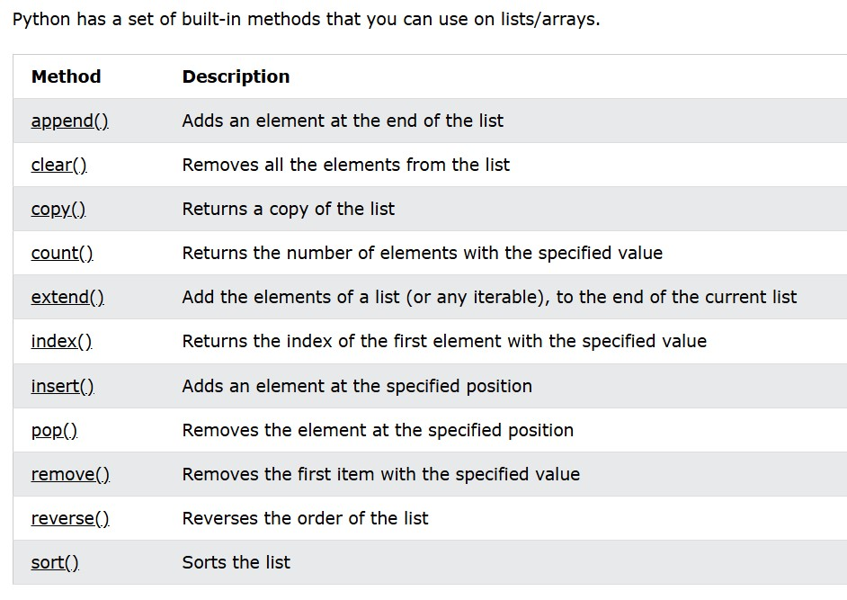

<h1 align="center">🌱 30 Days of Python 🌱</h1>
<p align="center">
  <a href="./Day06.md" target=""></a>  <a href="./Day08.md" target=""></a>
</p>

## **Day 7: Lists in Python**

### **Objective**
By the end of Day 7, You will understand lists thoroughly, be able to perform complex list operations, and leverage list comprehension for efficient coding.

### Vidoes
1. **[Video 1](https://www.youtube.com/watch?v=eF6nK5bSlmg&list=PLu0W_9lII9agwh1XjRt242xIpHhPT2llg&index=22)**
2. **[Video 2](https://www.youtube.com/watch?v=scWc3F8LbOo&list=PLu0W_9lII9agwh1XjRt242xIpHhPT2llg&index=23&ab_channel=CodeWithHarry)**
---

### **1. Theory**

#### **1.1 What is a List?**

- A **list** in Python is an ordered, mutable collection of items. It can contain items of different data types, such as integers, floats, strings, or even other lists.
- Lists are defined using square brackets `[]`, and items are separated by commas.
- **Example**:
  ```python
  fruits = ["apple", "banana", "cherry"]
  mixed_list = [1, "hello", 3.5, True]
  ```

#### **1.2 Key Properties of Lists**

- **Order is maintained**: Lists preserve the order of items.
- **Mutable**: Lists are mutable, meaning items can be added, removed, or changed after the list is created.
- **Allows duplicates**: Lists can contain duplicate values.
  
#### **1.3 Basic List Operations**

1. **Creating an Empty List**:
   ```python
   empty_list = []
   ```
  
2. **Accessing Elements**:
   - Access individual elements using their index. Remember that Python uses zero-based indexing.
   ```python
   fruits = ["apple", "banana", "cherry"]
   print(fruits[0])  # Output: apple
   print(fruits[2])  # Output: cherry
   ```
  
3. **Modifying Elements**:
   - Update an element by assigning a new value to its index.
   ```python
   fruits[1] = "blueberry"
   print(fruits)  # Output: ['apple', 'blueberry', 'cherry']
   ```

4. **Checking List Length**:
   - Use `len()` to get the number of elements in a list.
   ```python
   print(len(fruits))  # Output: 3
   ```

5. **List Concatenation and Repetition**:
   - Concatenate lists using `+` and repeat elements using `*`.
   ```python
   list1 = [1, 2, 3]
   list2 = [4, 5]
   combined = list1 + list2
   repeated = list1 * 2
   print(combined)  # Output: [1, 2, 3, 4, 5]
   print(repeated)  # Output: [1, 2, 3, 1, 2, 3]
   ```

---

### **2. Built-in Functions and Methods for Lists**

Python offers a wide range of built-in functions and methods for list manipulation:

#### **2.1 Adding Elements to a List**

1. **`.append()`**: Adds an item to the end of the list.
   ```python
   fruits = ["apple", "banana"]
   fruits.append("cherry")
   print(fruits)  # Output: ['apple', 'banana', 'cherry']
   ```

2. **`.insert(index, item)`**: Inserts an item at a specific index.
   ```python
   fruits.insert(1, "blueberry")
   print(fruits)  # Output: ['apple', 'blueberry', 'banana', 'cherry']
   ```

3. **`.extend()`**: Adds elements from another list to the end.
   ```python
   more_fruits = ["orange", "grape"]
   fruits.extend(more_fruits)
   print(fruits)  # Output: ['apple', 'banana', 'cherry', 'orange', 'grape']
   ```

#### **2.2 Removing Elements from a List**

1. **`.remove(item)`**: Removes the first occurrence of an item.
   ```python
   fruits = ["apple", "banana", "apple", "cherry"]
   fruits.remove("apple")
   print(fruits)  # Output: ['banana', 'apple', 'cherry']
   ```

2. **`.pop(index)`**: Removes and returns an item at a specific index (default is the last item).
   ```python
   item = fruits.pop(1)
   print(item)  # Output: 'banana'
   print(fruits)  # Output: ['apple', 'cherry']
   ```

3. **`.clear()`**: Removes all items from the list.
   ```python
   fruits.clear()
   print(fruits)  # Output: []
   ```

#### **2.3 Searching and Counting Elements**

1. **`.index(item)`**: Returns the index of the first occurrence of an item.
   ```python
   fruits = ["apple", "banana", "cherry"]
   print(fruits.index("banana"))  # Output: 1
   ```

2. **`.count(item)`**: Counts occurrences of an item.
   ```python
   print(fruits.count("apple"))  # Output: 1
   ```

#### **2.4 Sorting and Reversing a List**

1. **`.sort()`**: Sorts the list in ascending order (can also sort in descending order with `reverse=True`).
   ```python
   numbers = [3, 1, 4, 1, 5]
   numbers.sort()
   print(numbers)  # Output: [1, 1, 3, 4, 5]
   numbers.sort(reverse=True)
   print(numbers)  # Output: [5, 4, 3, 1, 1]
   ```

2. **`.reverse()`**: Reverses the order of items in the list.
   ```python
   numbers.reverse()
   print(numbers)  # Output: [1, 1, 3, 4, 5]
   ```




---

### **3. List Comprehension**

**List comprehension** is a concise way to create lists. It’s faster and simpler for straightforward transformations and filtering.

- **Syntax**:
  ```python
  [expression for item in iterable if condition]
  ```

- **Examples**:

1. **Simple List Comprehension**:
   - Create a list of squares for numbers from 1 to 5.
   ```python
   squares = [x**2 for x in range(1, 6)]
   print(squares)  # Output: [1, 4, 9, 16, 25]
   ```

2. **Filtering with List Comprehension**:
   - Create a list of even numbers from 1 to 10.
   ```python
   evens = [x for x in range(1, 11) if x % 2 == 0]
   print(evens)  # Output: [2, 4, 6, 8, 10]
   ```

3. **Transforming Data**:
   - Convert all fruit names to uppercase.
   ```python
   fruits = ["apple", "banana", "cherry"]
   upper_fruits = [fruit.upper() for fruit in fruits]
   print(upper_fruits)  # Output: ['APPLE', 'BANANA', 'CHERRY']
   ```

---

### **4. List Slicing**

**Slicing** allows extracting specific parts of a list. The syntax is `list[start:end:step]`.

1. **Basic Slicing**:
   - Get items from index 1 to 3 (end index is exclusive).
   ```python
   fruits = ["apple", "banana", "cherry", "date"]
   print(fruits[1:3])  # Output: ['banana', 'cherry']
   ```

2. **Slicing with Step**:
   - Get every second item in the list.
   ```python
   print(fruits[::2])  # Output: ['apple', 'cherry']
   ```

3. **Negative Indexing with Slicing**:
   - Reverse the list with slicing.
   ```python
   print(fruits[::-1])  # Output: ['date', 'cherry', 'banana', 'apple']
   ```

---

### **5. Practical Examples and Exercises**

#### **5.1 Working with List Comprehension**

1. **Generate Squares**:
   - Create a list of squares of numbers from 1 to 10.
   ```python
   squares = [x**2 for x in range(1, 11)]
   print(squares)
   ```

2. **Filter and Transform**:
   - Create a list of names with more than 4 characters and convert them to uppercase.
   ```python
   names = ["Swati", "Amit", "Raj", "Neha", "Rohan"]
   long_names = [name.upper() for name in names if len(name) > 4]
   print(long_names)  # Output: ['SWATI', 'ROHAN']
   ```

#### **5.2 Slicing Practice**

1. **Extract and Reverse**:
   - Given a list of days, extract weekdays and reverse them.
   ```python
   days = ["Monday", "Tuesday", "Wednesday", "Thursday", "Friday", "Saturday", "Sunday"]
   weekdays = days[:5][::-1]
   print(weekdays)  # Output: ['Friday', 'Thursday', 'Wednesday', 'Tuesday', 'Monday']
   ```

#### **5.3 Using Built-In Functions**


1. **Find Minimum and Maximum**:
   - Given a list of numbers, find the minimum and maximum values.
   ```python
   numbers = [5, 3, 8, 6, 2, 10]
   print("Minimum:", min(numbers))
   print("Maximum:", max(numbers))
   ```

---

### **6. Challenge Problems**

1. **Remove Duplicates**
   - Write a program to remove duplicates from a list without using `set()`.
   ```python
   numbers = [1, 2, 3, 2, 4, 1, 5]
   unique_numbers = []
   for num in numbers:
       if num not in unique_numbers:
           unique_numbers.append(num)
   print(unique_numbers)  # Output: [1, 2, 3, 4, 5]
   ```

2. **Flatten a List of Lists**
   - Given a list of lists, create a flat list of all items.
   ```python
   nested_list = [[1, 2, 3], [4, 5], [6, 7, 8]]
   flat_list = [item for sublist in nested_list for item in sublist]
   print(flat_list)  # Output: [1, 2, 3, 4, 5, 6, 7, 8]
   ```

3. **Find Common Elements in Two Lists**
   - Write a program to find common elements between two lists.
   ```python
   list1 = [1, 2, 3, 4, 5]
   list2 = [4, 5, 6, 7, 8]
   common_elements = [x for x in list1 if x in list2]
   print(common_elements)  # Output: [4, 5]
   ```

---

### **7. Wrap-Up: Review and Reflection**

By the end of today, You should feel confident working with lists, using list comprehensions, and applying list slicing for various purposes.

#### **Reflection Questions**
1. What is the difference between `.append()` and `.extend()`?
2. How does list comprehension differ from using a `for` loop to create lists?
3. How can you reverse a list without using the `.reverse()` method?

#### **Recap Quiz**
1. Write a list comprehension to generate a list of squares of even numbers from 1 to 20.
2. What does `fruits[1:3]` return if `fruits = ["apple", "banana", "cherry", "date"]`?
3. How do you remove all elements from a list?

---

### Hackerrank Problems
1. [All 5 Problems](https://www.hackerrank.com/domains/python?filters%5Bsubdomains%5D%5B%5D=py-basic-data-types)
2. []()
3. []()
4. []()
----------------------

<p align="center"> <a href="./Day06.md" target=""></a>  <a href="./Day08.md" target=""></a> </p>

---------------
